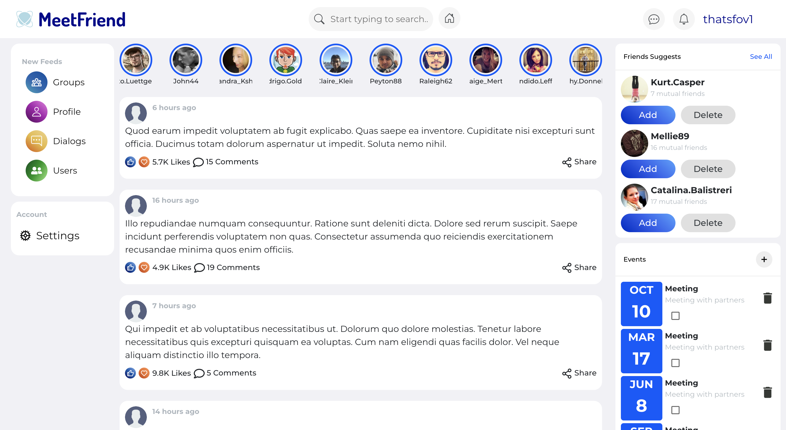
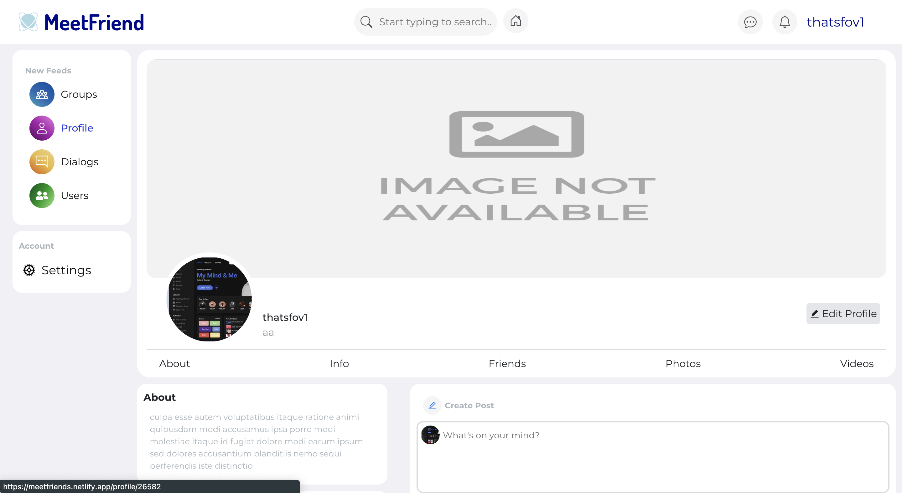
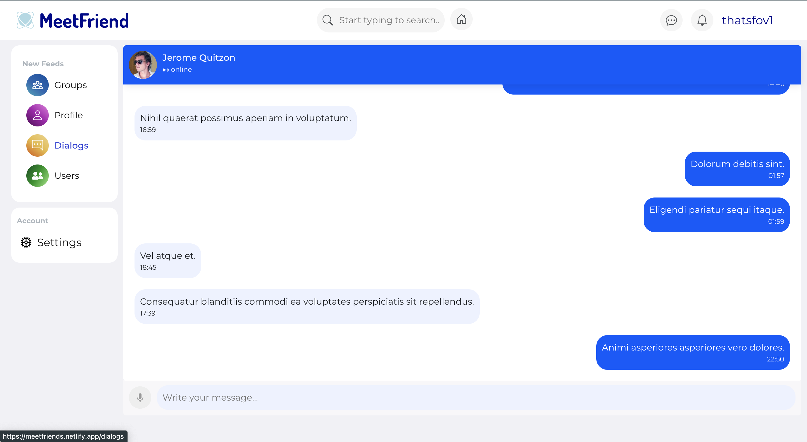

# MeetFriends🫂💬

Based on Facebook React Social Network with responsive design and many pages.


## Tech Stack

**Client:** React(Hooks), React-Router, Redux, Redux-Thunk.


## Features

- User Authentication
- Real Users
- Pagination
- All CRUD Operations
- Dialogue simulation


## FAQ

#### How long has it been in development?

Development took 2 or 3 months

#### How to Log in?

Email: evgkulikovskyy@gmail.com

Password: PASSWORDforapp123


## Screenshots






## Run Locally

Clone the project

```bash
  git clone https://github.com/thatsfov1/meetfriends.git
```

Go to the project directory

```bash
  cd meetfriends-main
```

Install dependencies

```bash
  npm install
```


## Running Tests

To run tests, run the following command

```bash
  npm run test
```

